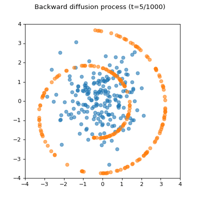

# Diffusion

## Setup

```
pip install -r requirements.txt
```

## Diffusion through stochastic differential equations on toy data

Refer to `sde/main.ipynb`



## Diffusion on images

### DDIM

```
python image_diffusion/train.py

python image_diffusion/sampling.py --ckpt_path ${CKPT_PATH} --save_dir ${SAVE_DIR_PATH}

python image_diffusion/dataset.py # to constuct eval directory.
python image_diffusion/fid/measure_fid.py /path/to/eval/dir /path/to/sample/dir
```

### Inpainting

```
python image_diffusion/repaint.py
```